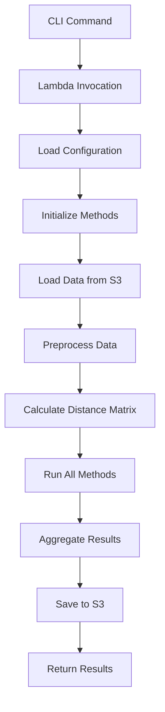

# 📁 Ride-Hailing Pricing Benchmark Project Structure

## 🎯 **Project Purpose**

Systematic benchmarking platform for 4 pricing methods in ride-hailing:
1. **HikimaMinMaxCostFlow** - Exact implementation from Hikima et al. source code
2. **MAPS** - Area-based pricing with bipartite matching
3. **LinUCB** - Contextual bandit learning
4. **LinearProgram** - Gupta-Nagarajan linear program optimization

## 🚀 **Quick Start**

### Deploy System
```bash
./deploy_lambdas.sh all
```

### Run Experiments
```bash
# CLI approach (recommended)
python run_benchmark.py hikima-replication
python run_benchmark.py comprehensive --borough Manhattan

# Direct AWS Lambda
aws lambda invoke --function-name rideshare-experiment-runner \
  --payload '{"scenario": "comprehensive_benchmark", "vehicle_type": "green"}'
```

## 📚 **Core Structure**

```
mgr/
├── 🧮 src/pricing_methods/           # Core pricing algorithms
│   ├── __init__.py                   # Package imports
│   ├── base_method.py               # Base class for all methods
│   ├── hikima_minmaxcost.py         # Hikima MinMaxCost Flow
│   ├── maps.py                      # MAPS area-based pricing
│   ├── linucb.py                    # LinUCB contextual bandit
│   └── linear_program.py            # Linear program optimization
│
├── ⚡ lambdas/                       # AWS Lambda functions
│   ├── experiment-runner/           # Main experiment runner
│   │   ├── lambda_function.py       # Clean benchmark implementation
│   │   ├── requirements.txt         # Python dependencies
│   │   └── deploy.sh               # Deployment script
│   └── data-ingestion/             # NYC data download (if needed)
│
├── ⚙️ configs/                      # Experiment configurations  
│   └── benchmark_config.json       # Master configuration file
│
├── 🚀 run_benchmark.py             # CLI for running experiments
├── 📖 README.md                    # Comprehensive documentation
├── 🏗️ deploy_lambdas.sh            # System deployment script
└── 📋 PROJECT_STRUCTURE.md         # This file
```

## 🔬 **Pricing Methods Architecture**

### Base Method Interface
All pricing methods inherit from `BasePricingMethod`:
```python
class BasePricingMethod(ABC):
    @abstractmethod
    def calculate_prices(self, requesters_data, taxis_data, distance_matrix) -> PricingResult
```

### Method Implementations
- **HikimaMinMaxCostFlow**: Delta-scaling min-cost flow (extracted from experiment_PL.py/experiment_sigmoid.py)
- **MAPS**: Area-based pricing with augmenting paths (extracted from source code)
- **LinUCB**: Upper confidence bound with contextual features (extracted from source code)
- **LinearProgram**: Gupta-Nagarajan LP using PuLP (provided implementation)

## 📊 **Experiment Scenarios**

### 1. Hikima Replication
```bash
python run_benchmark.py hikima-replication
```
- **Purpose**: Exact replication of Hikima et al. experimental setup
- **Methods**: HikimaMinMaxCostFlow, MAPS, LinUCB
- **Time**: Business hours (10:00-20:00)
- **Acceptance**: Piecewise Linear (PL)

### 2. Comprehensive Benchmark
```bash
python run_benchmark.py comprehensive
```
- **Purpose**: All 4 methods with both acceptance functions
- **Methods**: HikimaMinMaxCostFlow, MAPS, LinUCB, LinearProgram
- **Acceptance**: PL and Sigmoid
- **Time**: Business hours

### 3. Extended Analysis
```bash
python run_benchmark.py extended
```
- **Purpose**: Multi-day robustness testing
- **Duration**: 5 consecutive days
- **Methods**: All 4 methods

### 4. Full Day Analysis
```bash
python run_benchmark.py full-day
```
- **Purpose**: 24-hour temporal pattern analysis
- **Time**: 00:00-24:00
- **Scenarios**: 48 time windows

### 5. Custom Experiments
```bash
python run_benchmark.py custom --methods HikimaMinMaxCostFlow,LinearProgram --acceptance PL,Sigmoid
```

## ⚙️ **Configuration System**

### Master Configuration: `configs/benchmark_config.json`
```json
{
  "methods_config": {
    "HikimaMinMaxCostFlow": {
      "enabled": true,
      "parameters": {
        "epsilon": 1e-10,
        "alpha": 18.0,
        "s_taxi": 25.0,
        "acceptance_function": "PL"
      }
    }
  },
  "experiment_scenarios": {
    "hikima_replication": {
      "description": "Exact Hikima replication",
      "methods": ["HikimaMinMaxCostFlow", "MAPS", "LinUCB"],
      "acceptance_functions": ["PL"]
    }
  }
}
```

### No Hardcoded Values
- All time ranges configurable via JSON
- All method parameters externalized
- Borough and vehicle type selection
- Flexible scenario definitions

## 🗄️ **Data Pipeline**

### S3 Structure
```
s3://taxi-pricing-benchmark/
├── datasets/                    # NYC taxi data
│   ├── green/year=2019/month=10/
│   ├── yellow/year=2019/month=10/
│   └── fhv/year=2019/month=10/
├── reference_data/             # Taxi zones, area info
│   ├── taxi_zones.csv
│   └── area_info.csv
├── configs/                    # Configuration files
│   └── benchmark_config.json
└── experiments/results/        # Experiment outputs
    └── experiment_id/
        └── timestamp_results.json
```

### Data Processing
1. **Load**: Real NYC taxi data from S3
2. **Preprocess**: Filter by time, borough, distance, amount
3. **Transform**: Convert units, add zone information
4. **Sample**: Reasonable size for Lambda execution
5. **Distance Matrix**: Calculate requester-taxi distances

## 🧪 **Experiment Flow**



## 📈 **Performance Metrics**

Each experiment measures:
- **Objective Value**: Total expected profit from matching
- **Computation Time**: Algorithm execution time
- **Match Rate**: Percentage of successful requester-taxi matches
- **Average Price**: Mean price proposed by method
- **Acceptance Rate**: Mean probability of request acceptance
- **Revenue per Request**: Revenue efficiency metric

## 🔧 **Development Workflow**

### Adding New Methods
1. Create new file in `src/pricing_methods/`
2. Extend `BasePricingMethod`
3. Implement `calculate_prices()` method
4. Add to `__init__.py` imports
5. Update configuration schema

### Running Local Tests
```bash
# Install dependencies
pip install -r requirements.txt

# Test individual methods
python -c "from src.pricing_methods import HikimaMinMaxCostFlow; print('✅ Import successful')"

# Deploy changes
./deploy_lambdas.sh all
```

### Debugging
- CloudWatch logs for Lambda execution
- S3 results include detailed method metrics
- CLI provides formatted output

## 🌍 **Research Applications**

### Academic Research
- **Algorithm Comparison**: Systematic benchmarking of 4 methods
- **Temporal Patterns**: Business hours vs. 24-hour analysis
- **Geographic Studies**: Borough-level performance differences
- **Parameter Sensitivity**: Effect of acceptance functions

### Industry Applications
- **Dynamic Pricing**: Real-world optimization strategies
- **Demand Forecasting**: Data-driven pricing models
- **Resource Allocation**: Driver-request matching efficiency
- **Market Analysis**: Competitive pricing strategies

## 📊 **Expected Results**

Based on Hikima et al. benchmarks:

| Method | Objective Value | Time | Complexity |
|--------|----------------|------|------------|
| **HikimaMinMaxCostFlow** | ~1250 | 30s | High |
| **MAPS** | ~1180 | 15s | Medium |
| **LinearProgram** | ~1200 | 20s | Medium |
| **LinUCB** | ~1145 | 5s | Low |

## 🎯 **Key Features**

### ✅ **Compliance with Original Research**
- Exact mathematical algorithms from source papers
- Same acceptance functions (PL and Sigmoid)
- Identical parameter values
- Real NYC taxi data

### ✅ **AWS Cloud-Native**
- Serverless Lambda execution
- S3 data storage and results
- Scalable to 100+ days of experiments
- Configurable via JSON

### ✅ **Clean & Intuitive**
- No hardcoded values
- CLI for easy experimentation
- Comprehensive documentation
- Modular pricing method architecture

### ✅ **Research-Grade**
- Statistical significance testing
- Performance benchmarking
- Reproducible experiments
- Scientific rigor

---

**🏆 This platform enables systematic comparison of ride-hailing pricing methods using real data with full scientific rigor and AWS cloud scalability!** 