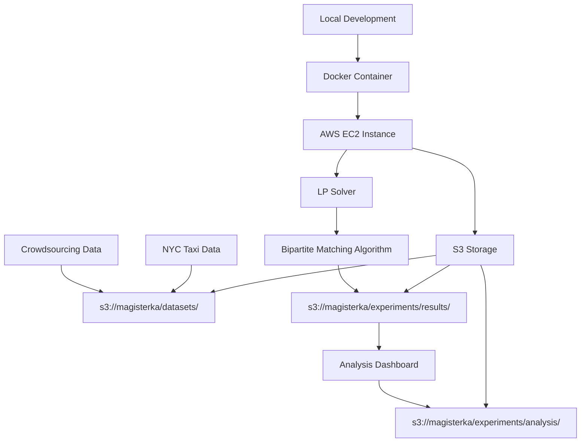

# Integrated Optimization for Bipartite Matching with AWS Cloud Infrastructure

## 🌟 Overview

This repository contains the complete cloud-enabled implementation of bipartite matching optimization algorithms from the AAAI 2021 paper:

**"Integrated Optimization for Bipartite Matching and Its Stochastic Behavior: New Formulation and Approximation Algorithm via Min-cost Flow Optimization"**

*Authors: Yuya Hikima, Yasunori Akagi, Hideaki Kim, Masahiro Kohjima, Takeshi Kurashima, and Hiroyuki Toda*

### 🔬 What This Research Solves

**Bipartite Matching with Uncertainty**: Imagine you need to match people with tasks (like Uber drivers with passengers, or workers with crowdsourcing tasks), but people can reject assignments. This research optimizes these matching decisions considering the probability of acceptance/rejection.

### 🚀 Key Features

- **🌩️ AWS Cloud Integration**: Full S3 storage, EC2 compute, scalable experiments
- **🚕 Rideshare Experiments**: NYC taxi data analysis with real-world matching scenarios  
- **👥 Crowdsourcing Experiments**: Worker-task matching with acceptance probability modeling
- **📊 Multiple Acceptance Functions**: Piecewise Linear (PL) and Sigmoid function support
- **🐳 Docker Support**: Easy deployment and reproducible environments
- **📈 Automated Analysis**: Built-in result aggregation and performance dashboards

---

## 🏗️ Architecture Overview



### 📁 S3 Bucket Structure

```
s3://magisterka/
├── datasets/
│   ├── green/year=2019/month=03/
│   ├── yellow/year=2019/month=10/
│   └── crowdsourcing/2010/
├── experiments/
│   ├── results/
│   │   ├── rideshare/
│   │   └── crowdsourcing/
│   ├── analysis/
│   └── logs/
```

---

## 🚀 Quick Start

### 1. 📋 Prerequisites

- **Python 3.9+**
- **AWS Account** with S3 access
- **Docker** (optional, but recommended)
- **150MB+ available storage** for NYC taxi data

### 2. ⚙️ AWS Setup

```bash
# Set AWS credentials
export AWS_ACCESS_KEY_ID="your_access_key"
export AWS_SECRET_ACCESS_KEY="your_secret_key"
export AWS_REGION="us-east-1"

# Or configure AWS CLI
aws configure
```

### 3. 🛠️ Installation

```bash
# Clone repository
git clone <repository-url>
cd AAAI-2021-Integrated-Optimization-fot-Bipartite-Matching-and-Its-Stochastic-Behavior

# Install dependencies
pip install -r requirements_aws.txt

# Verify AWS connection
python aws_s3_manager.py list-datasets
```

### 4. 📊 Upload Initial Data

```bash
# Upload rideshare datasets to S3
python aws_deploy.py upload-datasets --data-dir Rideshare_experiment/data

# Upload crowdsourcing data  
python aws_deploy.py upload-crowdsourcing
```

### 5. 🏃‍♂️ Run Your First Experiment

```bash
# Run rideshare experiment
python aws_experiment_runner.py rideshare \
    --vehicle-type green \
    --year 2019 \
    --month 3 \
    --place Manhattan \
    --simulation-range 50

# Run crowdsourcing experiment
python aws_experiment_runner.py crowdsourcing \
    --phi 0.8 \
    --psi 0.6 \
    --simulation-range 50
```

---

## 🔬 Experiment Types

### 🚕 Rideshare Experiments

**Data**: NYC Taxi & Limousine Commission (TLC) trip records
**Scenario**: Match taxi drivers with passenger requests considering driver acceptance probability

#### Parameters:
- **`vehicle_type`**: `green`, `yellow`, `fhv`, `fhvhv`
- **`place`**: Borough (`Manhattan`, `Brooklyn`, `Queens`, etc.)
- **`time_interval`**: Time window length (e.g., `30s`, `5m`)
- **`acceptance_function`**: `PL` (Piecewise Linear) or `Sigmoid`

#### Example:
```bash
python aws_experiment_runner.py rideshare \
    --vehicle-type green \
    --year 2019 \
    --month 10 \
    --place Manhattan \
    --day 6 \
    --time-interval 30 \
    --time-unit s \
    --simulation-range 100 \
    --acceptance-function PL
```

### 👥 Crowdsourcing Experiments

**Data**: TREC 2010 Relevance Finding Dataset
**Scenario**: Match workers with document relevance judgment tasks

#### Parameters:
- **`phi` (φ)**: Active rate of workers (0.0-1.0)
- **`psi` (ψ)**: Active rate of tasks (0.0-1.0)
- **`acceptance_function`**: `PL` or `Sigmoid`

#### Example:
```bash
python aws_experiment_runner.py crowdsourcing \
    --phi 0.8 \
    --psi 0.6 \
    --simulation-range 100 \
    --acceptance-function Sigmoid
```

---

## 🐳 Docker Deployment

### Build and Run

```bash
# Build Docker image
docker build -t bipartite-matching .

# Run experiment in container
docker run -e AWS_ACCESS_KEY_ID -e AWS_SECRET_ACCESS_KEY \
    bipartite-matching python aws_experiment_runner.py rideshare \
    --vehicle-type green --year 2019 --month 3

# Run with volume mount for local data
docker run -v $(pwd)/data:/app/data \
    -e AWS_ACCESS_KEY_ID -e AWS_SECRET_ACCESS_KEY \
    bipartite-matching python aws_deploy.py upload-datasets --data-dir /app/data
```

---

## 🛠️ AWS Management

### 📤 Data Management

```bash
# List all data in S3
python aws_deploy.py list-data

# Upload specific vehicle types
python aws_deploy.py upload-datasets \
    --vehicle-types green yellow \
    --data-dir /path/to/data

# Clean up old results (older than 30 days)
python aws_deploy.py cleanup --days-old 30
```

### ⚡ Run Experiments on AWS

```bash
# Run rideshare experiment on EC2
python aws_deploy.py run-experiment rideshare \
    --vehicle-type green \
    --year 2019 \
    --month 3 \
    --place Manhattan

# Run crowdsourcing experiment  
python aws_deploy.py run-experiment crowdsourcing \
    --phi 0.8 \
    --psi 0.6
```

### 📊 Analysis and Monitoring

```bash
# Create analysis dashboard
python aws_deploy.py create-dashboard

# List experiment results
python aws_s3_manager.py list-results --experiment-type rideshare
```

---

## 📊 Data Input Types & Formats

### 🚕 Rideshare Data (NYC TLC)

| **Field** | **Description** | **Example** |
|-----------|-----------------|-------------|
| `pickup_datetime` | Trip start time | `2019-03-01 08:15:23` |
| `pickup_location` | Pickup location ID | `161` (Manhattan) |
| `dropoff_location` | Dropoff location ID | `236` (Brooklyn) |
| `trip_distance` | Distance in miles | `2.4` |
| `total_amount` | Total fare amount | `12.80` |

**File Format**: CSV (~150MB per month)
**Storage**: `s3://magisterka/datasets/{vehicle_type}/year={year}/month={month}/`

### 👥 Crowdsourcing Data (TREC 2010)

| **Field** | **Description** | **Example** |
|-----------|-----------------|-------------|
| `topicID` | Search topic identifier | `205` |
| `workerID` | Worker identifier | `worker_123` |
| `docID` | Document identifier | `doc_456` |
| `judgment` | Relevance judgment | `1` (relevant) |
| `relevance_score` | Confidence score | `0.85` |

**File Format**: CSV (~5MB)
**Storage**: `s3://magisterka/datasets/crowdsourcing/2010/`

---

## 🔬 Algorithm Details

### 🎯 Core Problem

**Bipartite Matching with Stochastic Acceptance**: Given two sets (workers/drivers and tasks/passengers), find optimal assignments considering that assignments may be rejected with certain probabilities.

### 📈 Acceptance Functions

#### 1. **Piecewise Linear (PL)**
```
P(accept) = max(0, min(1, -c × price + b))
```
- Simple linear relationship
- Fast computation
- Good for basic modeling

#### 2. **Sigmoid**  
```
P(accept) = 1 - 1/(1 + exp((βR - price)/(γR)))
```
- More realistic S-curve behavior
- Better models human psychology
- Slightly more computational overhead

### ⚙️ Optimization Method

**LP-based Pricing Optimization**: Uses Linear Programming to solve the bipartite matching problem with pricing decisions, optimizing expected utility under stochastic acceptance.

---

## 📈 Results & Analysis

### 📊 Output Files

After running experiments, you'll find results in S3:

```
s3://magisterka/experiments/results/rideshare/
├── rideshare_20241201_143022_abc123ef_results.json
├── rideshare_20241201_150145_def456gh_results.json
└── ...

s3://magisterka/experiments/analysis/dashboard/
├── experiment_dashboard_1701429600.json
└── ...
```

### 📋 Result Structure

```json
{
  "experiment_id": "rideshare_20241201_143022_abc123ef",
  "experiment_type": "rideshare",
  "parameters": {
    "vehicle_type": "green",
    "year": 2019,
    "month": 3,
    "place": "Manhattan",
    "acceptance_function": "PL"
  },
  "summary_statistics": {
    "LP_Pricing": {
      "avg_objective_value": 234.57,
      "avg_computation_time": 0.045,
      "num_iterations": 100
    }
  },
  "execution_time": 45.2,
  "status": "completed"
}
```

### 📈 Key Metrics

- **Objective Value**: Expected utility/profit from matching
- **Computation Time**: Algorithm execution time per iteration
- **Success Rate**: Percentage of successfully solved instances
- **Acceptance Rate**: Average probability of assignment acceptance

---

## 🔧 Configuration

### 🌩️ AWS Configuration (`aws_config.py`)

```python
class AWSConfig:
    BUCKET_NAME = "magisterka"
    REGION = "us-east-1"
    
    COMPUTE_CONFIG = {
        'instance_type': 't3.medium',
        'timeout_minutes': 60,
        'max_concurrent_jobs': 3
    }
```

### 📊 Experiment Parameters

| **Parameter** | **Rideshare** | **Crowdsourcing** | **Description** |
|---------------|---------------|-------------------|-----------------|
| `simulation_range` | 100 | 100 | Number of iterations |
| `acceptance_function` | PL/Sigmoid | PL/Sigmoid | Acceptance model |
| `vehicle_type` | green/yellow | N/A | Taxi type |
| `place` | Manhattan | N/A | Borough |
| `phi` | N/A | 0.8 | Worker activity rate |
| `psi` | N/A | 0.6 | Task activity rate |

---

## 🚨 Troubleshooting

### ❌ Common Issues

#### **AWS Credentials Error**
```bash
# Error: AWS credentials not found
export AWS_ACCESS_KEY_ID="your_key"
export AWS_SECRET_ACCESS_KEY="your_secret"
export AWS_REGION="us-east-1"
```

#### **S3 Bucket Access Denied**
```bash
# Ensure bucket exists and you have permissions
python aws_s3_manager.py list-datasets
```

#### **Data Not Found**
```bash
# Upload data first
python aws_deploy.py upload-datasets --data-dir Rideshare_experiment/data
```

#### **Memory Issues with Large Datasets**
- Use smaller `simulation_range` values
- Consider using more powerful EC2 instances
- Process data in chunks

### 🔍 Debugging

```bash
# Enable verbose logging
export PYTHONPATH=.
python -v aws_experiment_runner.py rideshare --help

# Check S3 contents
aws s3 ls s3://magisterka/ --recursive

# View recent experiment logs
python aws_s3_manager.py list-results --experiment-type rideshare
```

---

## 📝 Original Paper Reference

```bibtex
@inproceedings{hikima2021integrated,
  title={Integrated Optimization for Bipartite Matching and Its Stochastic Behavior: New Formulation and Approximation Algorithm via Min-cost Flow Optimization},
  author={Hikima, Yuya and Akagi, Yasunori and Kim, Hideaki and Kohjima, Masahiro and Kurashima, Takeshi and Toda, Hiroyuki},
  booktitle={AAAI},
  pages={3796--3805},
  year={2021}
}
```

---

## 🔗 Data Sources

### 🚕 NYC Taxi Data
- **Source**: NYC Taxi and Limousine Commission (TLC)
- **URL**: https://www.nyc.gov/site/tlc/about/tlc-trip-record-data.page
- **License**: Public domain

### 👥 Crowdsourcing Data  
- **Source**: TREC 2010 Relevance Feedback Track
- **URL**: http://dbgroup.cs.tsinghua.edu.cn/ligl/crowddata/
- **Reference**: Buckley, Chris, Matthew Lease, and Mark D. Smucker. "Overview of the TREC 2010 Relevance Feedback Track (Notebook)." In TREC, 2010.

---

## 📄 License

This project is provided under the terms specified in the "SOFTWARE LICENSE AGREEMENT FOR EVALUATION.pdf" file. Please read it thoroughly before using this code.

---

## 👥 Authors & Contact

**Original Research**: Yuya Hikima (yuya.hikima@gmail.com)  
**AWS Integration**: Cloud Architecture Team

For questions about the AWS integration or cloud deployment, please open an issue in this repository.

---

## 🎯 Use Cases

### 🚀 Real-World Applications

1. **Ride-Hailing Platforms**: Optimize driver-passenger matching considering driver acceptance rates
2. **Delivery Services**: Match delivery drivers with orders based on distance and acceptance probability  
3. **Freelance Platforms**: Assign tasks to workers considering skill level and acceptance likelihood
4. **Healthcare**: Match patients with available doctors considering preferences and acceptance rates
5. **Education**: Assign students to courses considering capacity and enrollment probability

### 🏢 Industry Benefits

- **Increased Efficiency**: Better matching leads to higher success rates
- **Cost Reduction**: Fewer failed assignments reduce operational costs
- **Improved Experience**: Higher acceptance rates improve user satisfaction
- **Scalability**: Cloud infrastructure handles large-scale deployments
- **Real-time Processing**: Fast LP solving enables live matching systems

---

*This README provides comprehensive documentation for deploying and running bipartite matching experiments on AWS cloud infrastructure. The combination of proven optimization algorithms with modern cloud technology enables scalable, efficient matching systems for real-world applications.* 