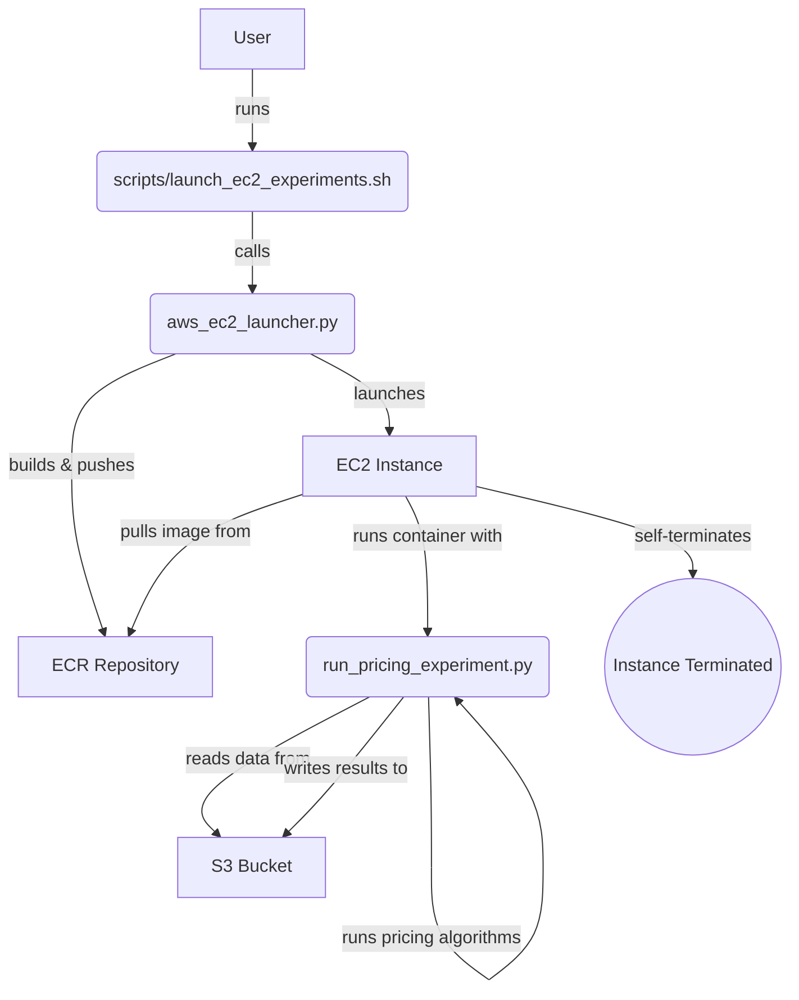

# Technical Guide

This document provides a detailed technical overview of the ride-hailing pricing experiment framework. It covers the system architecture, advanced usage scenarios, and instructions for configuration and troubleshooting.

## 1. System Architecture

The framework is designed to run pricing experiments in a containerized environment on AWS EC2. This provides a flexible and powerful way to execute large-scale simulations without the limitations of a serverless architecture.

The core components of the system are:

- **`scripts/launch_ec2_experiments.sh`**: The main user-facing script for launching experiments. It's a bash wrapper that simplifies the process of configuring and running a new experiment.
- **`aws_ec2_launcher.py`**: A Python script that handles the AWS infrastructure automation. It builds and pushes the Docker image to ECR, and then provisions an EC2 instance to run the experiment.
- **`run_pricing_experiment.py`**: The heart of the experiment logic. This Python script runs inside the Docker container and is responsible for loading data, executing the pricing algorithms, and saving the results.
- **`Dockerfile.ec2`**: Defines the container environment, ensuring all necessary dependencies are installed for the experiment to run correctly.

### Architectural Workflow

The following diagram illustrates the workflow from launching an experiment to retrieving the results:



## 2. Scenario Showcase

The `launch_ec2_experiments.sh` script is highly flexible. Here are some examples of different experiment scenarios you can run.

### Scenario 1: Quick Sanity Check

**Goal:** Verify that the entire pipeline is working correctly with a minimal, low-cost run.
**Configuration:** One day of data, the default `LinUCB` method, and a `small` EC2 instance.

```bash
./scripts/launch_ec2_experiments.sh \
  --start-date 2019-10-01 \
  --end-date 2019-10-01 \
  --ec2-type small
```

### Scenario 2: Method Comparison (Weekend Analysis)

**Goal:** Compare the performance of the `LP` and `LinUCB` pricing methods over a weekend.
**Configuration:** This requires two separate runs, one for each method.

**Run 1: LP Method**
```bash
./scripts/launch_ec2_experiments.sh \
  --start-date 2019-10-05 \
  --end-date 2019-10-06 \
  --method LP \
  --vehicle-type yellow \
  --ec2-type medium \
  --num-parallel 8
```

**Run 2: LinUCB Method**
```bash
./scripts/launch_ec2_experiments.sh \
  --start-date 2019-10-05 \
  --end-date 2019-10-06 \
  --method LinUCB \
  --vehicle-type yellow \
  --ec2-type medium \
  --num-parallel 8
```

### Scenario 3: Borough Performance Analysis

**Goal:** Analyze the impact of a pricing method in different parts of the city.
**Configuration:** Run the same experiment configuration in two different boroughs.

**Run 1: Manhattan**
```bash
./scripts/launch_ec2_experiments.sh \
  --start-date 2019-10-10 \
  --end-date 2019-10-10 \
  --borough Manhattan \
  --ec2-type medium
```

**Run 2: Brooklyn**
```bash
./scripts/launch_ec2_experiments.sh \
  --start-date 2019-10-10 \
  --end-date 2019-10-10 \
  --borough Brooklyn \
  --ec2-type medium
```

### Scenario 4: High-Resolution Rush Hour Analysis

**Goal:** Focus on a narrow time window (e.g., evening rush hour) to analyze pricing dynamics with greater detail.
**Configuration:** Use the `--start-hour` and `--end-hour` parameters to define the time window.

```bash
./scripts/launch_ec2_experiments.sh \
  --start-date 2019-10-21 \
  --end-date 2019-10-25 \
  --start-hour 16 \
  --end-hour 20 \
  --method MAPS \
  --ec2-type large \
  --num-parallel 16
```

## 3. Infrastructure Configuration

Before running the launcher script, you need to configure the AWS infrastructure parameters at the top of `scripts/launch_ec2_experiments.sh` and `aws_ec2_launcher.py`.

- **`REGION`**: The AWS region where the resources will be created.
- **`SUBNET_ID`**: The ID of the subnet for the EC2 instance. This subnet must have internet access to pull the Docker image.
- **`SECURITY_GROUP_IDS`**: Security group(s) for the instance. Must allow outbound HTTPS traffic (for ECR and S3) and inbound SSH if you need to debug.
- **`KEY_NAME`**: The name of an EC2 key pair to associate with the instance for SSH access.
- **`IAM_INSTANCE_PROFILE`**: The name of the IAM instance profile for the EC2 instance. It needs permissions for:
  - **ECR**: `ecr:GetAuthorizationToken`, `ecr:BatchCheckLayerAvailability`, `ecr:GetDownloadUrlForLayer`, `ecr:BatchGetImage`.
  - **S3**: `s3:GetObject`, `s3:PutObject`, `s3:ListBucket` on the relevant buckets and prefixes.

## 4. Monitoring & Debugging

While fully automated monitoring is not yet implemented, you can manually track the progress of your experiments.

1.  **EC2 Console:** After launching an experiment, the instance ID will be printed to the console. You can use this ID to find the instance in the AWS EC2 console and monitor its state.
2.  **CloudWatch Logs:** The `user-data` script configures the instance to send container logs to Amazon CloudWatch. Look for a log group named after your ECR repository (e.g., `/aws/docker/pricing-experiments`) to view the real-time output of `run_pricing_experiment.py`.
3.  **S3 Results:** The experiment results are saved to the specified S3 bucket. A `_SUCCESS` file mechanism is planned to be implemented to signal the successful completion of an experiment. You can monitor the target S3 path to see the output files as they are generated.

## 5. Extending the Framework

The framework is designed to be extensible. Here’s a brief guide to adding a new pricing method:

1.  **Implement the Logic:** Create a new Python class for your pricing method, inheriting from a base class (if one exists) in the `pricing_logic.py` or a similar module.
2.  **Integrate into the Runner:** In `run_pricing_experiment.py`, import your new class and add it to the dictionary of available methods.
3.  **Update the Launcher:** Add your new method's name to the list of choices for the `--method` argument in `scripts/launch_ec2_experiments.sh`.
4.  **Rebuild the Image:** The next time you run an experiment, the launcher will automatically rebuild the Docker image with your new code. 