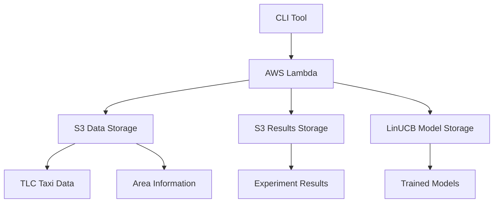

# Technical Documentation

Comprehensive technical guide for the Ride-Hailing Pricing Experiment System.

## 📋 Table of Contents

1. [System Architecture](#system-architecture)
2. [Data Setup](#data-setup)
3. [AWS Configuration](#aws-configuration)
4. [Deployment Guide](#deployment-guide)
5. [Data Validation](#data-validation)
6. [Experiment Execution](#experiment-execution)
7. [Results Analysis](#results-analysis)
8. [Troubleshooting](#troubleshooting)
9. [Advanced Usage](#advanced-usage)

## 🏗️ System Architecture

### Component Overview



### Data Flow

1. **CLI Tool** validates parameters and generates experiment events
2. **AWS Lambda** processes each scenario (5-minute time windows)
3. **Data Loading** from S3 parquet/CSV files
4. **Algorithm Execution** runs 4 pricing methods
5. **Results Aggregation** stores day-level summaries
6. **LinUCB Training** happens automatically when needed

## 📊 Data Setup

### 1. Download NYC TLC Data

#### Option A: Direct Download
```bash
# Create data directory
mkdir -p data/raw

# Download yellow taxi data for 2019
for month in {01..12}; do
    wget "https://d37ci6vzurychx.cloudfront.net/trip-data/yellow_tripdata_2019-${month}.parquet" \
        -O "data/raw/yellow_tripdata_2019-${month}.parquet"
done

# Download green taxi data for 2019
for month in {01..12}; do
    wget "https://d37ci6vzurychx.cloudfront.net/trip-data/green_tripdata_2019-${month}.parquet" \
        -O "data/raw/green_tripdata_2019-${month}.parquet"
done
```

#### Option B: AWS CLI Batch Download
```bash
# Create download script
cat > download_tlc_data.sh << 'EOF'
#!/bin/bash

BASE_URL="https://d37ci6vzurychx.cloudfront.net/trip-data"
YEAR=2019

# Yellow taxi data
for month in {01..12}; do
    echo "Downloading yellow taxi data for ${YEAR}-${month}"
    curl -o "data/raw/yellow_tripdata_${YEAR}-${month}.parquet" \
        "${BASE_URL}/yellow_tripdata_${YEAR}-${month}.parquet"
    
    # Verify download
    if [ $? -eq 0 ]; then
        echo "✅ Successfully downloaded yellow_tripdata_${YEAR}-${month}.parquet"
    else
        echo "❌ Failed to download yellow_tripdata_${YEAR}-${month}.parquet"
    fi
done

# Green taxi data
for month in {01..12}; do
    echo "Downloading green taxi data for ${YEAR}-${month}"
    curl -o "data/raw/green_tripdata_${YEAR}-${month}.parquet" \
        "${BASE_URL}/green_tripdata_${YEAR}-${month}.parquet"
    
    # Verify download
    if [ $? -eq 0 ]; then
        echo "✅ Successfully downloaded green_tripdata_${YEAR}-${month}.parquet"
    else
        echo "❌ Failed to download green_tripdata_${YEAR}-${month}.parquet"
    fi
done
EOF

chmod +x download_tlc_data.sh
./download_tlc_data.sh
```

### 2. Download Area Information

```bash
# Download taxi zone lookup
wget "https://d37ci6vzurychx.cloudfront.net/misc/taxi+_zone_lookup.csv" \
    -O "data/raw/taxi_zone_lookup.csv"

# Download zone shapefile (optional, for spatial analysis)
wget "https://d37ci6vzurychx.cloudfront.net/misc/taxi_zones.zip" \
    -O "data/raw/taxi_zones.zip"
unzip data/raw/taxi_zones.zip -d data/raw/taxi_zones/
```

### 3. Prepare Area Information File

Create the required area information file:

```python
import pandas as pd
import numpy as np

# Load taxi zone lookup
zones = pd.read_csv('data/raw/taxi+_zone_lookup.csv')

# Add approximate coordinates for each zone (simplified)
# In production, use actual zone centroids from shapefiles
np.random.seed(42)
zones['latitude'] = np.where(
    zones['Borough'] == 'Manhattan', 
    np.random.normal(40.7589, 0.02, len(zones)),
    np.where(zones['Borough'] == 'Brooklyn',
        np.random.normal(40.6892, 0.03, len(zones)),
        np.where(zones['Borough'] == 'Queens',
            np.random.normal(40.7282, 0.04, len(zones)),
            np.where(zones['Borough'] == 'Bronx',
                np.random.normal(40.8448, 0.03, len(zones)),
                np.random.normal(40.5795, 0.05, len(zones))  # Staten Island
            )
        )
    )
)

zones['longitude'] = np.where(
    zones['Borough'] == 'Manhattan', 
    np.random.normal(-73.9851, 0.02, len(zones)),
    np.where(zones['Borough'] == 'Brooklyn',
        np.random.normal(-73.9442, 0.03, len(zones)),
        np.where(zones['Borough'] == 'Queens',
            np.random.normal(-73.7949, 0.04, len(zones)),
            np.where(zones['Borough'] == 'Bronx',
                np.random.normal(-73.8648, 0.03, len(zones)),
                np.random.normal(-74.1502, 0.05, len(zones))  # Staten Island
            )
        )
    )
)

# Rename columns to match expected format
zones = zones.rename(columns={
    'LocationID': 'LocationID',
    'Borough': 'borough',
    'Zone': 'zone',
    'service_zone': 'service_zone'
})

# Save area information
zones.to_csv('area_info.csv', index=False)
print(f"✅ Created area_info.csv with {len(zones)} zones")
```

### 4. Upload Data to S3

```bash
# Upload taxi data
for file in data/raw/*.parquet; do
    filename=$(basename "$file")
    vehicle_type=$(echo "$filename" | cut -d'_' -f1)
    year_month=$(echo "$filename" | grep -o '[0-9]\{4\}-[0-9]\{2\}')
    year=$(echo "$year_month" | cut -d'-' -f1)
    month=$(echo "$year_month" | cut -d'-' -f2)
    
    echo "Uploading $filename to S3..."
    aws s3 cp "$file" \
        "s3://magisterka/datasets/${vehicle_type}/year=${year}/month=${month}/${filename}"
done

# Upload area information
aws s3 cp area_info.csv s3://magisterka/data/area_information.csv

echo "✅ Data upload completed"
```

## ⚙️ AWS Configuration

### 1. IAM Policy Setup

Create IAM policy for Lambda execution:

```json
{
    "Version": "2012-10-17",
    "Statement": [
        {
            "Effect": "Allow",
            "Action": [
                "logs:CreateLogGroup",
                "logs:CreateLogStream",
                "logs:PutLogEvents"
            ],
            "Resource": "arn:aws:logs:*:*:*"
        },
        {
            "Effect": "Allow",
            "Action": [
                "s3:GetObject",
                "s3:PutObject",
                "s3:ListBucket"
            ],
            "Resource": [
                "arn:aws:s3:::magisterka",
                "arn:aws:s3:::magisterka/*"
            ]
        },
        {
            "Effect": "Allow",
            "Action": [
                "lambda:InvokeFunction"
            ],
            "Resource": "*"
        }
    ]
}
```

### 2. Create S3 Bucket

```bash
# Create bucket with versioning
aws s3 mb s3://magisterka
aws s3api put-bucket-versioning \
    --bucket magisterka \
    --versioning-configuration Status=Enabled

# Create folder structure
aws s3api put-object --bucket magisterka --key datasets/
aws s3api put-object --bucket magisterka --key experiments/
aws s3api put-object --bucket magisterka --key models/
aws s3api put-object --bucket magisterka --key data/
```

### 3. Configure AWS CLI

```bash
# Configure credentials
aws configure set aws_access_key_id YOUR_ACCESS_KEY
aws configure set aws_secret_access_key YOUR_SECRET_KEY
aws configure set default.region eu-north-1
aws configure set default.output json

# Test configuration
aws sts get-caller-identity
```

## 🚀 Deployment Guide

### 1. Deploy Lambda Function

```bash
# Navigate to Lambda directory
cd lambdas/pricing-benchmark

# Build and deploy using the deployment script
./deploy_lambdas.sh

# Or deploy manually with proper configuration
zip -r pricing-benchmark.zip . -x "*.git*" "*.DS_Store*" "*.pyc*" "__pycache__/*"

# Create Lambda function
aws lambda create-function \
    --function-name pricing-benchmark-lambda \
    --runtime python3.9 \
    --role arn:aws:iam::YOUR_ACCOUNT:role/lambda-execution-role \
    --handler lambda_function.lambda_handler \
    --zip-file fileb://pricing-benchmark.zip \
    --timeout 900 \
    --memory-size 3008 \
    --environment Variables='{
        "S3_BUCKET":"magisterka"
    }'

echo "✅ Lambda function deployed successfully"
```

### 2. Test Deployment

```bash
# Test with simple payload
aws lambda invoke \
    --function-name pricing-benchmark-lambda \
    --payload '{"test_mode": true}' \
    test_response.json

# Check response
cat test_response.json

# Should see successful imports and test results
```

### 3. Update Function Code

When making changes to the Lambda function:

```bash
cd lambdas/pricing-benchmark
zip -r pricing-benchmark.zip . -x "*.git*" "*.DS_Store*" "*.pyc*" "__pycache__/*"
aws lambda update-function-code \
    --function-name pricing-benchmark-lambda \
    --zip-file fileb://pricing-benchmark.zip

echo "✅ Lambda function updated"
```

## ✅ Data Validation

### 1. Validate S3 Data Structure

```bash
# Check if data is properly uploaded
echo "Checking S3 data structure..."

# List datasets
aws s3 ls s3://magisterka/datasets/ --recursive | head -10

# Check specific vehicle types and structure
aws s3 ls s3://magisterka/datasets/yellow/year=2019/ --recursive
aws s3 ls s3://magisterka/datasets/green/year=2019/ --recursive

# Verify area information exists
aws s3 ls s3://magisterka/data/area_information.csv
```

### 2. Data Quality Check Script

```python
import boto3
import pandas as pd
import io

def validate_data_quality():
    """Comprehensive data quality validation."""
    s3 = boto3.client('s3')
    bucket = 'magisterka'
    
    print("🔍 Starting data quality validation...")
    
    # Check yellow taxi data for October 2019
    try:
        key = 'datasets/yellow/year=2019/month=10/yellow_tripdata_2019-10.parquet'
        print(f"📥 Loading: {key}")
        
        response = s3.get_object(Bucket=bucket, Key=key)
        df = pd.read_parquet(io.BytesIO(response['Body'].read()))
        
        print(f"✅ Yellow taxi data loaded: {len(df):,} records")
        print(f"📊 Columns: {list(df.columns)}")
        print(f"📅 Date range: {df['tpep_pickup_datetime'].min()} to {df['tpep_pickup_datetime'].max()}")
        
        # Check data quality
        quality_issues = []
        
        if df['trip_distance'].isna().sum() > 0:
            quality_issues.append(f"Missing trip distances: {df['trip_distance'].isna().sum():,}")
        if (df['trip_distance'] <= 0).sum() > 0:
            quality_issues.append(f"Zero/negative distances: {(df['trip_distance'] <= 0).sum():,}")
        if df['total_amount'].isna().sum() > 0:
            quality_issues.append(f"Missing amounts: {df['total_amount'].isna().sum():,}")
        if (df['total_amount'] <= 0).sum() > 0:
            quality_issues.append(f"Zero/negative amounts: {(df['total_amount'] <= 0).sum():,}")
        
        # Check location IDs
        invalid_pu = (df['PULocationID'] <= 0) | (df['PULocationID'] >= 264)
        invalid_do = (df['DOLocationID'] <= 0) | (df['DOLocationID'] >= 264)
        if invalid_pu.sum() > 0:
            quality_issues.append(f"Invalid pickup locations: {invalid_pu.sum():,}")
        if invalid_do.sum() > 0:
            quality_issues.append(f"Invalid dropoff locations: {invalid_do.sum():,}")
        
        if quality_issues:
            print("⚠️ Data quality issues found:")
            for issue in quality_issues:
                print(f"   - {issue}")
        else:
            print("✅ Data quality looks good")
        
        # Sample statistics
        print(f"📊 Sample statistics:")
        print(f"   - Average trip distance: {df['trip_distance'].mean():.2f} miles")
        print(f"   - Average fare: ${df['total_amount'].mean():.2f}")
        print(f"   - Records per day: {len(df) / 31:.0f}")
            
    except Exception as e:
        print(f"❌ Error loading yellow taxi data: {e}")
    
    # Check green taxi data
    try:
        key = 'datasets/green/year=2019/month=10/green_tripdata_2019-10.parquet'
        print(f"\n📥 Loading: {key}")
        
        response = s3.get_object(Bucket=bucket, Key=key)
        df_green = pd.read_parquet(io.BytesIO(response['Body'].read()))
        
        print(f"✅ Green taxi data loaded: {len(df_green):,} records")
        
    except Exception as e:
        print(f"⚠️ Green taxi data not found: {e}")
    
    # Check area information
    try:
        key = 'data/area_information.csv'
        print(f"\n📥 Loading: {key}")
        
        response = s3.get_object(Bucket=bucket, Key=key)
        area_df = pd.read_csv(io.BytesIO(response['Body'].read()))
        
        print(f"✅ Area information loaded: {len(area_df)} zones")
        print(f"🏙️ Boroughs: {area_df['borough'].unique()}")
        print(f"📍 Location ID range: {area_df['LocationID'].min()} - {area_df['LocationID'].max()}")
        
        # Check for required columns
        required_cols = ['LocationID', 'borough', 'latitude', 'longitude']
        missing_cols = [col for col in required_cols if col not in area_df.columns]
        if missing_cols:
            print(f"❌ Missing columns in area info: {missing_cols}")
        else:
            print("✅ All required area information columns present")
        
    except Exception as e:
        print(f"❌ Error loading area info: {e}")
    
    print("\n🎯 Data validation completed")

if __name__ == "__main__":
    validate_data_quality()
```

Save as `validate_data.py` and run:

```bash
python validate_data.py
```

### 3. Test Lambda Function Connectivity

```bash
# Test Lambda function can access S3 data
aws lambda invoke \
    --function-name pricing-benchmark-lambda \
    --payload '{
        "test_mode": true,
        "year": 2019,
        "month": 10,
        "day": 6,
        "borough": "Manhattan",
        "vehicle_type": "yellow"
    }' \
    lambda_test_response.json

cat lambda_test_response.json
```

## 🧪 Experiment Execution

### 1. Basic Experiments

#### Single Day, Single Method
```bash
# Start with fastest method to test setup
python run_pricing_experiment.py \
    --year=2019 --month=10 --day=6 \
    --borough=Manhattan --vehicle_type=yellow \
    --eval=PL --methods=MAPS
```

#### Single Day, All Methods
```bash
# Run all methods for comprehensive comparison
python run_pricing_experiment.py \
    --year=2019 --month=10 --day=6 \
    --borough=Manhattan --vehicle_type=yellow \
    --eval=PL --methods=LP,MinMaxCostFlow,LinUCB,MAPS
```

#### Multiple Evaluation Functions
```bash
# Compare PL vs Sigmoid acceptance functions
python run_pricing_experiment.py \
    --year=2019 --month=10 --day=6 \
    --borough=Manhattan --vehicle_type=yellow \
    --eval=PL,Sigmoid --methods=LinUCB,MAPS
```

### 2. Multi-Day Experiments

#### Specific Days
```bash
# Weekend vs weekday comparison (Oct 1,5,6,12 = Tue,Sat,Sun,Sat)
python run_pricing_experiment.py \
    --year=2019 --month=10 --days=1,5,6,12 \
    --borough=Manhattan --vehicle_type=yellow \
    --eval=PL --methods=LinUCB,MAPS
```

#### Date Range
```bash
# Full week analysis
python run_pricing_experiment.py \
    --year=2019 --month=10 --start_day=1 --end_day=7 \
    --borough=Manhattan --vehicle_type=green \
    --eval=PL,Sigmoid --methods=LinUCB,MAPS
```

#### Full Month (Resource Intensive)
```bash
# Complete month - use fast methods only
python run_pricing_experiment.py \
    --year=2019 --month=10 --start_day=1 --end_day=31 \
    --borough=Queens --vehicle_type=yellow \
    --eval=PL --methods=LinUCB,MAPS
```

### 3. Advanced Experiments

#### Multi-Borough Comparison
```bash
# Run same experiment across all boroughs
for borough in Manhattan Brooklyn Queens Bronx; do
    echo "🏙️ Running experiment for $borough"
    python run_pricing_experiment.py \
        --year=2019 --month=10 --day=6 \
        --borough=$borough --vehicle_type=yellow \
        --eval=PL --methods=LinUCB,MAPS \
        --training_id="multi_borough_$(date +%Y%m%d_%H%M%S)"
    
    # Brief pause between boroughs
    sleep 30
done
```

#### Vehicle Type Comparison
```bash
# Compare yellow vs green taxis
TRAINING_ID="vehicle_comparison_$(date +%Y%m%d_%H%M%S)"

echo "🚕 Running yellow taxi experiment"
python run_pricing_experiment.py \
    --year=2019 --month=10 --day=6 \
    --borough=Manhattan --vehicle_type=yellow \
    --eval=PL --methods=LinUCB,MAPS \
    --training_id=$TRAINING_ID

echo "🚖 Running green taxi experiment"
python run_pricing_experiment.py \
    --year=2019 --month=10 --day=6 \
    --borough=Manhattan --vehicle_type=green \
    --eval=PL --methods=LinUCB,MAPS \
    --training_id=$TRAINING_ID
```

#### Custom Time Windows
```bash
# Extended hours (6 AM to 11 PM) - 17 hours vs standard 10 hours
python run_pricing_experiment.py \
    --year=2019 --month=10 --day=6 \
    --borough=Manhattan --vehicle_type=yellow \
    --eval=PL --methods=LinUCB,MAPS \
    --hour_start=6 --hour_end=23

# Short time window (peak hours only)
python run_pricing_experiment.py \
    --year=2019 --month=10 --day=6 \
    --borough=Manhattan --vehicle_type=yellow \
    --eval=PL --methods=LinUCB,MAPS \
    --hour_start=17 --hour_end=19
```

### 4. Performance Optimization

#### High-Performance Methods Only
```bash
# Exclude computationally intensive MinMaxCostFlow for large experiments
python run_pricing_experiment.py \
    --year=2019 --month=10 --start_day=1 --end_day=15 \
    --borough=Manhattan --vehicle_type=yellow \
    --eval=PL --methods=LinUCB,MAPS
```

#### Parallel Processing (Be Careful with Lambda Limits)
```bash
#!/bin/bash
# parallel_days.sh - Process multiple days in parallel

DAYS=(1 6 10 15 20 25)
MAX_PARALLEL=3
CURRENT_JOBS=0

for day in "${DAYS[@]}"; do
    echo "🚀 Starting experiment for day $day"
    
    python run_pricing_experiment.py \
        --year=2019 --month=10 --day=$day \
        --borough=Manhattan --vehicle_type=yellow \
        --eval=PL --methods=LinUCB,MAPS &
    
    ((CURRENT_JOBS++))
    
    # Limit concurrent jobs to avoid Lambda throttling
    if [ $CURRENT_JOBS -ge $MAX_PARALLEL ]; then
        wait
        CURRENT_JOBS=0
    fi
done

# Wait for remaining jobs
wait
echo "✅ All parallel experiments completed"
```

## 📈 Results Analysis

### 1. Check Experiment Results

```bash
# List all experiments for a specific configuration
aws s3 ls s3://magisterka/experiments/type=yellow/eval=PL/borough=Manhattan/year=2019/month=10/ --recursive

# Download specific result file
aws s3 cp \
    "s3://magisterka/experiments/type=yellow/eval=PL/borough=Manhattan/year=2019/month=10/day=06/20250627_pricing_exp_yellow_Manhattan_20250627.json" \
    results.json

# View results
cat results.json | jq '.'
```

### 2. Comprehensive Result Analysis Script

```python
import json
import boto3
import pandas as pd
import matplotlib.pyplot as plt
import seaborn as sns
from typing import Dict, List, Optional
import numpy as np

class ExperimentAnalyzer:
    """Comprehensive analyzer for pricing experiment results."""
    
    def __init__(self, bucket_name: str = 'magisterka'):
        self.bucket_name = bucket_name
        self.s3 = boto3.client('s3')
        
    def find_experiments_by_training_id(self, training_id: str) -> List[str]:
        """Find all result files for a specific training ID."""
        result_files = []
        paginator = self.s3.get_paginator('list_objects_v2')
        
        for page in paginator.paginate(Bucket=self.bucket_name, Prefix='experiments/'):
            if 'Contents' in page:
                for obj in page['Contents']:
                    if training_id in obj['Key'] and obj['Key'].endswith('.json'):
                        result_files.append(obj['Key'])
        
        return result_files
    
    def load_experiment_data(self, training_id: str) -> Optional[pd.DataFrame]:
        """Load and parse all experiment data for a training ID."""
        result_files = self.find_experiments_by_training_id(training_id)
        
        if not result_files:
            print(f"❌ No result files found for training ID: {training_id}")
            return None
        
        print(f"📁 Found {len(result_files)} result files")
        
        all_results = []
        
        for file_key in result_files:
            try:
                response = self.s3.get_object(Bucket=self.bucket_name, Key=file_key)
                data = json.loads(response['Body'].read().decode('utf-8'))
                
                # Extract metadata from file path
                parts = file_key.split('/')
                metadata = {
                    'vehicle_type': parts[1].split('=')[1],
                    'eval_function': parts[2].split('=')[1],
                    'borough': parts[3].split('=')[1],
                    'year': int(parts[4].split('=')[1]),
                    'month': int(parts[5].split('=')[1]),
                    'day': int(parts[6].split('=')[1])
                }
                
                # Extract method performance
                method_summary = data.get('method_performance_summary', {})
                day_stats = data.get('day_statistics', {})
                
                for method, stats in method_summary.items():
                    result = {
                        'training_id': training_id,
                        'file_path': file_key,
                        **metadata,
                        'method': method,
                        'objective_value_mean': stats['objective_value']['mean'],
                        'objective_value_std': stats['objective_value']['std'],
                        'objective_value_total': stats['objective_value']['total'],
                        'computation_time_mean': stats['computation_time']['mean'],
                        'computation_time_total': stats['computation_time']['total'],
                        'success_rate': stats['success_rate'],
                        'scenarios_run': stats['scenarios_run'],
                        'total_requesters': day_stats.get('requesters', {}).get('total', 0),
                        'total_taxis': day_stats.get('taxis', {}).get('total', 0),
                        'avg_requesters': day_stats.get('requesters', {}).get('mean', 0),
                        'avg_taxis': day_stats.get('taxis', {}).get('mean', 0)
                    }
                    all_results.append(result)
                    
            except Exception as e:
                print(f"⚠️ Error processing {file_key}: {e}")
        
        if all_results:
            df = pd.DataFrame(all_results)
            df['date'] = pd.to_datetime(df[['year', 'month', 'day']])
            return df
        else:
            return None
    
    def generate_summary_report(self, training_id: str) -> str:
        """Generate comprehensive summary report."""
        df = self.load_experiment_data(training_id)
        
        if df is None:
            return "❌ No data found for analysis"
        
        report = []
        report.append("📊 EXPERIMENT ANALYSIS REPORT")
        report.append("=" * 60)
        report.append(f"Training ID: {training_id}")
        report.append(f"Generated: {pd.Timestamp.now().strftime('%Y-%m-%d %H:%M:%S')}")
        report.append("")
        
        # Basic statistics
        report.append("🎯 EXPERIMENT OVERVIEW")
        report.append("-" * 30)
        report.append(f"Total experiments: {len(df)}")
        report.append(f"Methods tested: {', '.join(df['method'].unique())}")
        report.append(f"Vehicle types: {', '.join(df['vehicle_type'].unique())}")
        report.append(f"Boroughs: {', '.join(df['borough'].unique())}")
        report.append(f"Evaluation functions: {', '.join(df['eval_function'].unique())}")
        report.append(f"Date range: {df['date'].min().strftime('%Y-%m-%d')} to {df['date'].max().strftime('%Y-%m-%d')}")
        report.append("")
        
        # Method performance ranking
        report.append("🏆 METHOD PERFORMANCE RANKING")
        report.append("-" * 40)
        method_perf = df.groupby('method').agg({
            'objective_value_mean': ['mean', 'std', 'count'],
            'computation_time_mean': 'mean',
            'success_rate': 'mean'
        }).round(3)
        
        method_perf.columns = ['Avg_Objective', 'Std_Objective', 'Count', 'Avg_Time', 'Success_Rate']
        method_perf = method_perf.sort_values('Avg_Objective', ascending=False)
        report.append(method_perf.to_string())
        report.append("")
        
        # Performance by configuration
        if len(df['eval_function'].unique()) > 1:
            report.append("📋 PERFORMANCE BY EVALUATION FUNCTION")
            report.append("-" * 45)
            eval_perf = df.groupby(['method', 'eval_function'])['objective_value_mean'].mean().unstack()
            report.append(eval_perf.to_string())
            report.append("")
        
        if len(df['borough'].unique()) > 1:
            report.append("🏙️ PERFORMANCE BY BOROUGH")
            report.append("-" * 30)
            borough_perf = df.groupby(['method', 'borough'])['objective_value_mean'].mean().unstack(fill_value=0).round(2)
            report.append(borough_perf.to_string())
            report.append("")
        
        # Computational efficiency
        report.append("⚡ COMPUTATIONAL EFFICIENCY")
        report.append("-" * 35)
        efficiency = df.groupby('method').agg({
            'computation_time_mean': ['mean', 'std'],
            'scenarios_run': 'sum'
        }).round(3)
        efficiency.columns = ['Avg_Time', 'Std_Time', 'Total_Scenarios']
        efficiency = efficiency.sort_values('Avg_Time')
        report.append(efficiency.to_string())
        report.append("")
        
        # Data volume analysis
        report.append("📊 DATA VOLUME ANALYSIS")
        report.append("-" * 30)
        data_vol = df.groupby(['date', 'borough']).agg({
            'total_requesters': 'first',
            'total_taxis': 'first',
            'avg_requesters': 'first',
            'avg_taxis': 'first'
        }).round(1)
        report.append(data_vol.to_string())
        report.append("")
        
        return "\n".join(report)
    
    def create_visualizations(self, training_id: str) -> str:
        """Create comprehensive visualization plots."""
        df = self.load_experiment_data(training_id)
        
        if df is None:
            return "❌ No data found for visualization"
        
        # Set up the plot style
        plt.style.use('seaborn-v0_8')
        fig = plt.figure(figsize=(16, 12))
        
        # 1. Method performance comparison
        plt.subplot(2, 3, 1)
        method_means = df.groupby('method')['objective_value_mean'].mean().sort_values(ascending=False)
        bars = plt.bar(range(len(method_means)), method_means.values)
        plt.title('Average Objective Value by Method', fontsize=12, fontweight='bold')
        plt.xlabel('Method')
        plt.ylabel('Objective Value')
        plt.xticks(range(len(method_means)), method_means.index, rotation=45)
        
        # Add value labels on bars
        for i, bar in enumerate(bars):
            plt.text(bar.get_x() + bar.get_width()/2, bar.get_height() + 0.01,
                    f'{method_means.values[i]:.1f}', ha='center', va='bottom')
        
        # 2. Computation time comparison
        plt.subplot(2, 3, 2)
        time_data = [df[df['method'] == method]['computation_time_mean'].values 
                    for method in df['method'].unique()]
        plt.boxplot(time_data, labels=df['method'].unique())
        plt.title('Computation Time Distribution', fontsize=12, fontweight='bold')
        plt.xlabel('Method')
        plt.ylabel('Time (seconds)')
        plt.xticks(rotation=45)
        
        # 3. Success rate by method
        plt.subplot(2, 3, 3)
        success_rates = df.groupby('method')['success_rate'].mean()
        colors = ['green' if x >= 0.95 else 'orange' if x >= 0.8 else 'red' for x in success_rates.values]
        bars = plt.bar(range(len(success_rates)), success_rates.values, color=colors)
        plt.title('Success Rate by Method', fontsize=12, fontweight='bold')
        plt.xlabel('Method')
        plt.ylabel('Success Rate')
        plt.xticks(range(len(success_rates)), success_rates.index, rotation=45)
        plt.ylim(0, 1.05)
        
        # Add percentage labels
        for i, bar in enumerate(bars):
            plt.text(bar.get_x() + bar.get_width()/2, bar.get_height() + 0.01,
                    f'{success_rates.values[i]:.1%}', ha='center', va='bottom')
        
        # 4. Performance over time (if multiple days)
        plt.subplot(2, 3, 4)
        if len(df['date'].unique()) > 1:
            for method in df['method'].unique():
                method_data = df[df['method'] == method]
                plt.plot(method_data['date'], method_data['objective_value_mean'], 
                        marker='o', label=method, linewidth=2, markersize=4)
            plt.title('Performance Over Time', fontsize=12, fontweight='bold')
            plt.xlabel('Date')
            plt.ylabel('Objective Value')
            plt.legend()
            plt.xticks(rotation=45)
        else:
            plt.text(0.5, 0.5, 'Single Day Experiment\nNo Temporal Analysis', 
                    ha='center', va='center', transform=plt.gca().transAxes,
                    fontsize=10, style='italic')
            plt.title('Performance Over Time (N/A)', fontsize=12, fontweight='bold')
        
        # 5. Evaluation function comparison (if multiple)
        plt.subplot(2, 3, 5)
        if len(df['eval_function'].unique()) > 1:
            eval_perf = df.groupby(['method', 'eval_function'])['objective_value_mean'].mean().unstack()
            eval_perf.plot(kind='bar', ax=plt.gca())
            plt.title('Performance by Evaluation Function', fontsize=12, fontweight='bold')
            plt.xlabel('Method')
            plt.ylabel('Objective Value')
            plt.legend(title='Eval Function')
            plt.xticks(rotation=45)
        else:
            plt.text(0.5, 0.5, f'Single Evaluation Function\n({df["eval_function"].iloc[0]})', 
                    ha='center', va='center', transform=plt.gca().transAxes,
                    fontsize=10, style='italic')
            plt.title('Evaluation Function Comparison (N/A)', fontsize=12, fontweight='bold')
        
        # 6. Data volume vs performance
        plt.subplot(2, 3, 6)
        plt.scatter(df['total_requesters'], df['objective_value_mean'], 
                   c=df['method'].astype('category').cat.codes, alpha=0.6, s=30)
        plt.title('Data Volume vs Performance', fontsize=12, fontweight='bold')
        plt.xlabel('Total Requesters')
        plt.ylabel('Objective Value')
        
        # Add method legend
        methods = df['method'].unique()
        for i, method in enumerate(methods):
            plt.scatter([], [], c=f'C{i}', label=method)
        plt.legend(title='Method', bbox_to_anchor=(1.05, 1), loc='upper left')
        
        plt.tight_layout()
        
        # Save plot
        plot_filename = f'experiment_analysis_{training_id}.png'
        plt.savefig(plot_filename, dpi=300, bbox_inches='tight')
        plt.show()
        
        return f"📊 Visualizations saved to: {plot_filename}"
    
    def export_detailed_results(self, training_id: str) -> str:
        """Export detailed results to CSV for further analysis."""
        df = self.load_experiment_data(training_id)
        
        if df is None:
            return "❌ No data found for export"
        
        # Export main results
        csv_filename = f'detailed_results_{training_id}.csv'
        df.to_csv(csv_filename, index=False)
        
        # Create summary statistics file
        summary_filename = f'summary_stats_{training_id}.csv'
        summary_stats = df.groupby(['method', 'eval_function', 'borough']).agg({
            'objective_value_mean': ['mean', 'std', 'min', 'max'],
            'computation_time_mean': ['mean', 'std'],
            'success_rate': 'mean',
            'scenarios_run': 'sum',
            'total_requesters': 'sum',
            'total_taxis': 'sum'
        }).round(3)
        
        summary_stats.to_csv(summary_filename)
        
        return f"📁 Results exported to:\n  - {csv_filename}\n  - {summary_filename}"

# Usage example
def analyze_experiment(training_id: str):
    """Complete analysis workflow for an experiment."""
    analyzer = ExperimentAnalyzer()
    
    print(f"🔍 Analyzing experiment: {training_id}")
    print("=" * 60)
    
    # Generate text report
    report = analyzer.generate_summary_report(training_id)
    print(report)
    
    # Save report to file
    report_filename = f'report_{training_id}.txt'
    with open(report_filename, 'w') as f:
        f.write(report)
    print(f"\n📄 Report saved to: {report_filename}")
    
    # Create visualizations
    viz_result = analyzer.create_visualizations(training_id)
    print(f"\n{viz_result}")
    
    # Export detailed data
    export_result = analyzer.export_detailed_results(training_id)
    print(f"\n{export_result}")
    
    print(f"\n✅ Analysis complete for training ID: {training_id}")

if __name__ == "__main__":
    import sys
    if len(sys.argv) > 1:
        training_id = sys.argv[1]
        analyze_experiment(training_id)
    else:
        print("Usage: python analyze_experiment.py <training_id>")
        print("Example: python analyze_experiment.py pricing_exp_yellow_Manhattan_20250627")
```

Save as `analyze_experiment.py` and run:

```bash
python analyze_experiment.py pricing_exp_yellow_Manhattan_20250627_002546
```

## 🔧 Troubleshooting

### Common Issues and Solutions

#### 1. Lambda Function Not Found
```
Error: Function not found: pricing-benchmark-lambda
```

**Solution**: Deploy the Lambda function
```bash
cd lambdas/pricing-benchmark
chmod +x deploy_lambdas.sh
./deploy_lambdas.sh

# Or check if function exists
aws lambda list-functions --query 'Functions[?FunctionName==`pricing-benchmark-lambda`]'
```

#### 2. S3 Access Denied
```
Error: Access Denied when accessing S3 bucket
```

**Solutions**:
```bash
# Check AWS credentials
aws sts get-caller-identity

# Check bucket exists and you have access
aws s3 ls s3://magisterka

# Test bucket permissions
aws s3 cp area_info.csv s3://magisterka/test/
aws s3 rm s3://magisterka/test/area_info.csv
```

#### 3. Data Not Found
```
Error: Could not load data from S3
```

**Solutions**:
```bash
# Verify data structure
aws s3 ls s3://magisterka/datasets/yellow/year=2019/month=10/ --recursive

# Check specific file
aws s3 ls s3://magisterka/datasets/yellow/year=2019/month=10/yellow_tripdata_2019-10.parquet

# Validate data format
python validate_data.py
```

#### 4. LinUCB Training Fails
```
Error: LinUCB training failed
```

**Solutions**:
```bash
# Check training data exists
aws s3 ls s3://magisterka/datasets/yellow/year=2019/month=07/ --recursive

# Increase Lambda timeout for training
aws lambda update-function-configuration \
    --function-name pricing-benchmark-lambda \
    --timeout 900

# Check Lambda logs
aws logs tail /aws/lambda/pricing-benchmark-lambda --follow
```

#### 5. Memory/Timeout Issues
```
Error: Lambda timeout or out of memory
```

**Solutions**:
```bash
# Increase Lambda memory and timeout
aws lambda update-function-configuration \
    --function-name pricing-benchmark-lambda \
    --memory-size 3008 \
    --timeout 900

# Use faster methods for large experiments
python run_pricing_experiment.py \
    --year=2019 --month=10 --start_day=1 --end_day=31 \
    --borough=Manhattan --vehicle_type=yellow \
    --eval=PL --methods=LinUCB,MAPS  # Exclude MinMaxCostFlow
```

#### 6. Import Errors in Lambda
```
Error: No module named 'numpy' or similar
```

**Solutions**:
```bash
# Redeploy with correct dependencies
cd lambdas/pricing-benchmark
pip install -r requirements.txt -t .
zip -r pricing-benchmark.zip . -x "*.git*"
aws lambda update-function-code \
    --function-name pricing-benchmark-lambda \
    --zip-file fileb://pricing-benchmark.zip
```

### Debug Mode

Enable detailed logging:

```bash
# Test Lambda function directly
aws lambda invoke \
    --function-name pricing-benchmark-lambda \
    --payload '{
        "test_mode": true,
        "year": 2019,
        "month": 10,
        "day": 6
    }' \
    debug_response.json

cat debug_response.json | jq '.'
```

### Performance Monitoring

```bash
# Monitor Lambda logs in real-time
aws logs tail /aws/lambda/pricing-benchmark-lambda --follow

# Check recent errors
aws logs filter-log-events \
    --log-group-name /aws/lambda/pricing-benchmark-lambda \
    --start-time $(date -d '1 hour ago' +%s)000 \
    --filter-pattern "ERROR"

# Monitor S3 usage
aws s3api list-objects-v2 \
    --bucket magisterka \
    --prefix experiments/ \
    --query 'length(Contents)'
```

This technical documentation provides comprehensive guidance for setting up, deploying, and running the ride-hailing pricing experiment system. It covers everything from data download to advanced analysis techniques, ensuring users can successfully execute experiments and analyze results. 