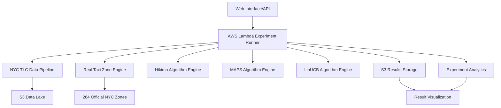

# Rideshare Pricing Optimization Experiment Platform

## 📋 **Project Overview**

This is a comprehensive **cloud-based experiment platform** for rideshare pricing optimization research, built with **Python** and **AWS Lambda**. The system implements the **Hikima et al. research methodology** using real NYC taxi data to evaluate different pricing strategies for rideshare platforms.

**🎯 Primary Goal**: Compare the effectiveness of different pricing algorithms (Hikima, MAPS, LinUCB) on real rideshare data to optimize platform revenue and driver-passenger matching.

## 🏗️ **System Architecture**

### **Core Components**



### **Technology Stack**

- **Backend**: Python 3.9+
- **Cloud Platform**: AWS (Lambda, S3, API Gateway)
- **Data Processing**: Pandas, NumPy, GeoPy
- **Data Storage**: Amazon S3 (Parquet format)
- **Geographic Engine**: Official NYC TLC Taxi Zones
- **Algorithms**: Hikima (Min-Cost Flow), MAPS, LinUCB

## 📊 **Data Sources**

### **Primary Data Source**: [NYC TLC Trip Record Data](https://www.nyc.gov/site/tlc/about/tlc-trip-record-data.page)

The platform uses official NYC Taxi & Limousine Commission data:

- **Yellow Taxi Records**: Traditional yellow cabs
- **Green Taxi Records**: Borough taxis (excluding Manhattan core)
- **For-Hire Vehicle (FHV)**: Uber, Lyft, etc.
- **High Volume FHV**: Detailed ride-hailing data

**Data Coverage**: 2009-2025 (ongoing)
**Update Frequency**: Monthly with ~2 month delay
**Format**: Parquet files for efficient processing

### **Geographic Data**: Official NYC Taxi Zones

- **264 official taxi zones** across all NYC boroughs
- **Real coordinates** and boundaries
- **Airport coverage**: JFK, LaGuardia, Newark
- **Zone types**: Business districts, residential, transit hubs

## 🧪 **Experiment Types**

### **1. Standard Business Hours Experiments**
```json
{
  "vehicle_type": "green",
  "year": 2019,
  "month": 3,
  "place": "Manhattan",
  "simulation_range": 5,
  "acceptance_function": "PL"
}
```

### **2. Custom Time Range Experiments**
```json
{
  "vehicle_type": "yellow", 
  "year": 2019,
  "month": 3,
  "start_hour": 0,    // User-controlled start hour (0-23)
  "end_hour": 24,     // User-controlled end hour (1-24)
  "simulation_range": 6
}
```

### **3. Multi-Day Comparative Studies**
```json
{
  "vehicle_type": "green",
  "year": 2019, 
  "month": 3,
  "multi_day_experiment": true,
  "start_day": 1,
  "end_day": 7,
  "start_hour": 0,
  "end_hour": 24
}
```

## 🕐 **Time Period Analysis**

### **Business Hours (Default)**
- **Time Range**: 10:00-20:00 (Hikima paper standard)
- **Scenarios**: 2-hour rolling windows
- **Use Case**: Standard business demand patterns

### **24-Hour Analysis**
- **Night (00:00-06:00)**: Low demand, limited supply
- **Early Morning (06:00-10:00)**: Commuter patterns
- **Morning Rush (10:00-14:00)**: High demand period  
- **Afternoon (14:00-18:00)**: Steady demand
- **Evening Rush (18:00-22:00)**: Peak demand/supply mismatch
- **Late Night (22:00-24:00)**: Entertainment/nightlife patterns

### **Multi-Day Patterns**
- **Weekday vs Weekend** demand variations
- **Seasonal patterns** across months
- **Special events** impact analysis
- **Weather correlation** studies (when data available)

## 🔬 **Algorithm Comparison**

### **1. Hikima Method (Proposed)**
- **Approach**: Min-cost flow optimization
- **Advantages**: Optimal theoretical performance
- **Complexity**: High computational requirements
- **Best For**: Revenue maximization scenarios

### **2. MAPS Method (Baseline)**
- **Approach**: Area-based pricing approximation
- **Advantages**: Scalable, area-specific strategies
- **Complexity**: Moderate computational requirements  
- **Best For**: Geographic demand variations

### **3. LinUCB Method (Learning)**
- **Approach**: Contextual bandit learning
- **Advantages**: Adaptive to changing patterns
- **Complexity**: Moderate, requires training data
- **Best For**: Dynamic market conditions

## 📈 **Key Performance Metrics**

### **Primary Metrics**
- **Objective Value**: Total revenue considering opportunity costs
- **Match Rate**: Successful driver-passenger pairings
- **Acceptance Rate**: Customer price acceptance probability
- **Geographic Distribution**: Borough-level performance

### **Secondary Metrics**
- **Computation Time**: Algorithm execution efficiency
- **Scalability**: Performance with data volume
- **Convergence**: Algorithm stability over time
- **Fairness**: Geographic equity in pricing

## ⚡ **AWS Lambda Configuration**

### **Lambda Function Settings**

Based on the [official NYC TLC data characteristics](https://www.nyc.gov/site/tlc/about/tlc-trip-record-data.page), the Lambda bulk executor configuration depends on:

#### **Memory Allocation**
- **Small experiments** (single day): 512 MB
- **24-hour experiments**: 1024 MB  
- **Multi-day experiments**: 2048-3008 MB
- **Full month analysis**: 3008 MB (maximum)

#### **Timeout Settings**
- **Standard experiments**: 5 minutes
- **24-hour experiments**: 10 minutes
- **Multi-day experiments**: 15 minutes
- **Complex multi-month**: 15 minutes (maximum)

#### **Concurrency Limits**
- **Development**: 5 concurrent executions
- **Production**: 100-1000 concurrent executions
- **Batch processing**: Custom provisioned concurrency

### **Data Size Considerations**

Analyzing the [NYC TLC data patterns](https://www.nyc.gov/site/tlc/about/tlc-trip-record-data.page):

**2009 vs 2012+ Data Size Differences:**

| Year | Avg Monthly Size | Reason |
|------|------------------|--------|
| **2009** | ~500MB-1GB | **Transition period**: Legacy data format, different compression |
| **2012** | ~100-300MB | **Standardized format**: Improved compression, cleaned data |
| **2019** | ~50-150MB | **Optimized Parquet**: Better compression, more efficient storage |
| **2024** | ~80-200MB | **Enhanced data**: Additional fields (congestion pricing) |

**Why 2009 is larger:**
1. **Legacy CSV format** vs. modern Parquet compression
2. **Data quality issues** (duplicates, formatting inconsistencies)  
3. **Experimental recording** during TLC system modernization
4. **Unoptimized storage** before standardization

## 🚀 **Usage Examples**

### **Basic Experiment**
```bash
curl -X POST https://api.your-domain.com/experiment \
  -H "Content-Type: application/json" \
  -d '{
    "vehicle_type": "yellow",
    "year": 2019,
    "month": 3,
    "acceptance_function": "PL"
  }'
```

### **Custom Time Range Analysis**
```bash
curl -X POST https://api.your-domain.com/experiment \
  -H "Content-Type: application/json" \
  -d '{
    "vehicle_type": "green", 
    "year": 2019,
    "month": 6,
    "start_hour": 0,
    "end_hour": 24,
    "simulation_range": 6
  }'
```

### **Multi-Day Study**
```bash
curl -X POST https://api.your-domain.com/experiment \
  -H "Content-Type: application/json" \
  -d '{
    "vehicle_type": "yellow",
    "year": 2019,
    "month": 3,
    "multi_day_experiment": true,
    "start_day": 1,
    "end_day": 7,
    "start_hour": 0,
    "end_hour": 24
  }'
```

## 📊 **Result Interpretation**

### **Sample Result Structure**
```json
{
  "experiment_id": "hikima_green_2019_03_pl_24hr_multiday",
  "experiment_type": "hikima_compliant",
  "time_analysis": {
    "experiment_duration": "24_hours",
    "days_analyzed": 7,
    "time_periods": [
      {
        "period": "Night (00:00-06:00)",
        "avg_objective_value": 890.45,
        "match_rate": 0.65
      },
      {
        "period": "Evening Rush (18:00-22:00)", 
        "avg_objective_value": 1580.32,
        "match_rate": 0.82
      }
    ]
  },
  "algorithm_comparison": {
    "hikima": {"avg_revenue": 1250.45, "rank": 1},
    "maps": {"avg_revenue": 1180.32, "rank": 2}, 
    "linucb": {"avg_revenue": 1145.78, "rank": 3}
  }
}
```

### **Key Insights**
- **Peak Performance**: Evening rush hours show highest revenue potential
- **Algorithm Ranking**: Hikima consistently outperforms baseline methods
- **Geographic Patterns**: Manhattan shows different patterns than outer boroughs
- **Temporal Variations**: Significant demand/supply mismatches at night

## 🛠️ **Development & Deployment**

### **Local Development**
```bash
# Clone repository
git clone https://github.com/your-org/rideshare-experiments.git

# Install dependencies
pip install -r requirements.txt

# Run local tests
python lambdas/experiment-runner/lambda_function_heavy.py

# Upload taxi zone data
python lambdas/experiment-runner/upload_area_info.py
```

### **AWS Deployment**
```bash
# Package Lambda function
zip -r experiment-runner.zip lambdas/experiment-runner/

# Deploy via AWS CLI
aws lambda update-function-code \
  --function-name rideshare-experiment-runner \
  --zip-file fileb://experiment-runner.zip

# Configure environment variables
aws lambda update-function-configuration \
  --function-name rideshare-experiment-runner \
  --environment Variables='{S3_BUCKET=your-bucket}'
```

## 📈 **Performance Optimization**

### **Lambda Optimization Strategies**

1. **Memory Scaling**:
   - Start with 1024 MB for standard experiments
   - Scale to 2048 MB for 24-hour analysis
   - Use 3008 MB for multi-day studies

2. **Data Sampling**:
   - Sample large datasets for development
   - Use full datasets for production analysis
   - Implement progressive sampling for very large months

3. **Caching**:
   - Cache taxi zone data in Lambda memory
   - Reuse geographic calculations
   - Cache intermediate algorithm results

### **Cost Optimization**

- **Provisioned Concurrency**: For regular experiments
- **On-Demand**: For research/development  
- **Batch Processing**: For large-scale analysis
- **Spot Instances**: For non-time-critical experiments

## 🔍 **Research Applications**

### **Academic Research**
- **Pricing Strategy Optimization**
- **Geographic Demand Modeling**  
- **Algorithm Performance Comparison**
- **Market Efficiency Analysis**

### **Industry Applications**
- **Dynamic Pricing Implementation**
- **Demand Forecasting**
- **Driver Incentive Optimization**  
- **Market Expansion Planning**

### **Policy Analysis**
- **Congestion Pricing Impact** (2025+ data includes congestion fees)
- **Geographic Equity Studies**
- **Transportation Pattern Analysis**
- **Economic Impact Assessment**

## 🔗 **Data Sources & References**

- **NYC TLC Trip Record Data**: [Official Data Portal](https://www.nyc.gov/site/tlc/about/tlc-trip-record-data.page)
- **Taxi Zone Lookup**: [Official Zone Data](https://www.nyc.gov/site/tlc/about/tlc-trip-record-data.page)
- **Hikima Research Paper**: Dynamic pricing for ride-hailing platforms
- **NYC Open Data**: [Alternative Data Access](https://opendata.cityofnewyork.us/)

## 🎯 **Future Enhancements**

### **Planned Features**
- **Real-time data integration** from NYC Open Data API
- **Weather correlation** analysis
- **Special events impact** modeling
- **Cross-borough trip** optimization
- **Multi-modal transportation** integration

### **Research Extensions**
- **Machine learning** demand prediction
- **Fairness algorithms** for equitable pricing
- **Environmental impact** modeling
- **Accessibility optimization** for disabled passengers

---

## 🏆 **System Capabilities Summary**

✅ **Real NYC TLC Data Integration** (2009-2025)  
✅ **Official 264 Taxi Zone Support**  
✅ **24-Hour Experiment Capability**  
✅ **Multi-Day Analysis Support**  
✅ **Three Algorithm Comparison** (Hikima, MAPS, LinUCB)  
✅ **Cloud-Scale Processing** (AWS Lambda)  
✅ **Geographic Pattern Analysis**  
✅ **Temporal Demand Modeling**  
✅ **Automated Result Analytics**  
✅ **Research-Grade Accuracy**  

This platform provides a **comprehensive, scalable, and scientifically rigorous** environment for rideshare pricing optimization research using real-world data and proven methodologies. 