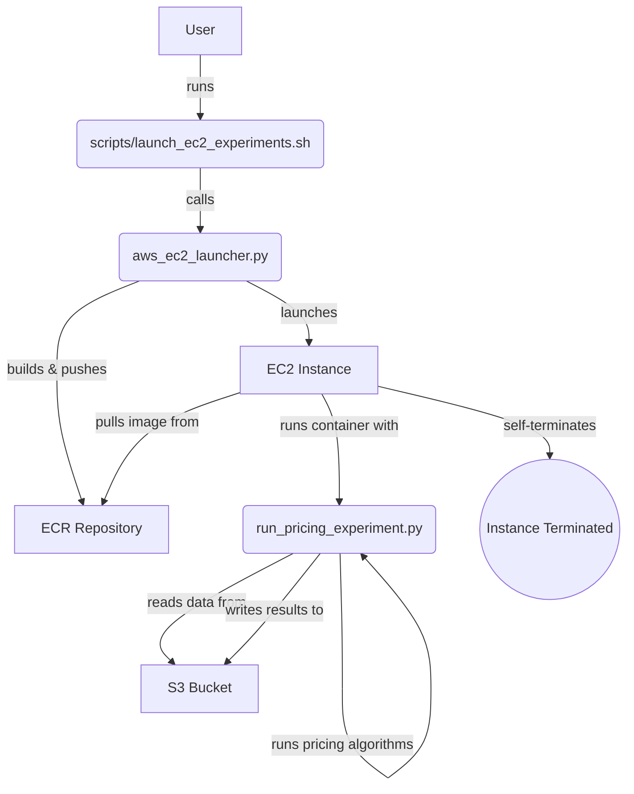

# Ride-Hailing Pricing Experiment Framework

> **2024-07 Update** – The project has been streamlined to use a flexible EC2-based architecture.  
> The `scripts/launch_ec2_experiments.sh` script is the main entry point for running experiments.

This document provides a comprehensive guide to the ride-hailing pricing experiment framework, covering everything from quick start instructions to technical details about the system architecture.

## 1. Quick Start

The primary way to run experiments is through the `scripts/launch_ec2_experiments.sh` script. It provides a wide range of options to configure your experiment and launches the necessary cloud infrastructure.

### 1.1. Prerequisites

Before you can launch an experiment, you must have the following:
- **AWS CLI**: Configured with credentials that have permission to manage EC2, ECR, and S3.
- **Docker**: Running locally to build the experiment container.
- **`.env` file**: A file in the project root containing your AWS infrastructure details.

### 1.2. Configuration

The recommended way to provide your AWS infrastructure details is to use a `.env` file.

1.  **Create the `.env` file**: Copy the provided template to a new `.env` file:
    ```bash
    cp .env.example .env
    ```
2.  **Edit `.env`**: Open the `.env` file and fill in the values for your AWS environment. The launch script will automatically source this file.

Here are some one-liner commands to help you find these values.

- **`REGION`**: The AWS region where the resources will be created.
- **`SUBNET_ID`**: Find subnets in your default VPC. This subnet must have internet access to pull the Docker image.
  ```sh
  aws ec2 describe-subnets --filters "Name=vpc-id,Values=$(aws ec2 describe-vpcs --filters "Name=isDefault,Values=true" --query "Vpcs[0].VpcId" --output text)" --query "Subnets[].SubnetId" --output text
  ```
- **`SECURITY_GROUP_IDS`**: Find security groups, preferably one named `default` or `pricing-experiment`. Must allow outbound HTTPS traffic (for ECR and S3) and inbound SSH if you need to debug.
  ```sh
  aws ec2 describe-security-groups --query "SecurityGroups[?GroupName=='default' || contains(GroupName, 'pricing')].GroupId" --output text
  ```
- **`KEY_NAME`**: List your available EC2 key pairs.
  ```sh
  aws ec2 describe-key-pairs --query "KeyPairs[].KeyName" --output text
  ```
- **`IAM_INSTANCE_PROFILE`**: The name of the IAM instance profile for the EC2 instance. It needs permissions for ECR and S3. To find a suitable profile, run:
  ```sh
  aws iam list-instance-profiles --query "InstanceProfiles[?contains(InstanceProfileName, 'Pricing')].InstanceProfileName" --output text
  ```

> **Note on Multiple Values:** If any of these commands return multiple IDs and you are unsure which one to use, it is best to log in to the AWS Management Console to visually inspect the resources. Look for resources that are tagged with a name like `pricing-experiment` or are configured for the correct VPC. Adding unique tags to your AWS resources is a good practice to make them easily identifiable.

### 1.3. Running Experiments

Once your `.env` file is configured, you can run experiments as shown in the examples below. After the container exits, the instance will shut itself down. Remember to **terminate** it in the EC2 console to stop billing.

The `scripts/cleanup_resources.sh` utility script can be used to terminate all project-related EC2 instances.

---

## 2. System Architecture

The framework is designed to run pricing experiments in a containerized environment on AWS EC2. This provides a flexible and powerful way to execute large-scale simulations without the limitations of a serverless architecture.

### 2.1. Core Components
- **`scripts/launch_ec2_experiments.sh`**: The main user-facing script for launching experiments. It's a bash wrapper that simplifies the process of configuring and running a new experiment.
- **`aws_ec2_launcher.py`**: A Python script that handles the AWS infrastructure automation. It builds and pushes the Docker image to ECR, and then provisions an EC2 instance to run the experiment.
- **`run_pricing_experiment.py`**: The heart of the experiment logic. This Python script runs inside the Docker container and is responsible for loading data, executing the pricing algorithms, and saving the results.
- **`Dockerfile.ec2`**: Defines the container environment, ensuring all necessary dependencies are installed for the experiment to run correctly.

### 2.2. Architectural Workflow

The following diagram illustrates the workflow from launching an experiment to retrieving the results:



---

## 3. Scenario Showcase

The `scripts/launch_ec2_experiments.sh` script is highly flexible. Here are some examples of different experiment scenarios you can run.

### 3.1. Basic Sanity Check
This command launches a small EC2 instance to run the LinUCB method for a single day on a small sample of green taxi data.

```bash
# Launch a small, one-day experiment
./scripts/launch_ec2_experiments.sh \
  --start-date 2019-10-06 \
  --end-date 2019-10-06 \
  --ec2-type small
```

### 3.2. Comprehensive Weekly Experiment
This command runs a larger experiment over a week, using a more powerful EC2 instance. It tests the Linear Programming method on yellow taxi data in Manhattan.

```bash
# Launch a week-long experiment on a medium instance
./scripts/launch_ec2_experiments.sh \
  --start-date 2019-10-01 \
  --end-date 2019-10-07 \
  --method LP \
  --vehicle-type yellow \
  --borough Manhattan \
  --ec2-type medium
```

### 3.3. Multi-Iteration Monte Carlo
This example demonstrates how to run a Monte Carlo simulation with a specific number of iterations and a custom seed.

```bash
# Run a Monte Carlo simulation with 5000 iterations
./scripts/launch_ec2_experiments.sh \
  --start-date 2019-10-15 \
  --end-date 2019-10-15 \
  --num-iter 5000 \
  --seed 123 \
  --ec2-type large
```

### 3.4. All-Method Comparison
This runs a comprehensive benchmark, comparing all available pricing methods in a single run. This is ideal for understanding the relative performance of each algorithm under the same conditions.

```bash
# Run all methods on a large instance
./scripts/launch_ec2_experiments.sh \
  --start-date 2019-10-10 \
  --end-date 2019-10-10 \
  --method "LP,MinMaxCostFlow,LinUCB,MAPS" \
  --ec2-type xlarge \
  --num-parallel 16
```

### 3.5. Comprehensive "Kitchen Sink" Run
This example shows all available arguments in use. It runs a highly specific, multi-day experiment designed for a very particular research question.

```bash
# A highly customized, multi-day run on a powerful instance
./scripts/launch_ec2_experiments.sh \
  --start-date 2019-11-01 \
  --end-date 2019-11-05 \
  --start-hour 8 \
  --end-hour 22 \
  --borough "Brooklyn" \
  --vehicle-type "fhv" \
  --method "LinUCB,LP" \
  --eval "Sigmoid" \
  --num-iter 5000 \
  --num-parallel 32 \
  --ec2-type "extra-large" \
  --seed 999
```

---

## 4. Framework Details

### 4.1. Core Features

#### Pricing Algorithms
- **LP**: Gupta-Nagarajan Linear Program optimization
- **MinMaxCostFlow**: Capacity scaling min-cost flow algorithm  
- **LinUCB**: Contextual bandit learning with pre-trained models
- **MAPS**: Area-based pricing with bipartite matching

#### Acceptance Functions
- **PL**: Piecewise Linear (`acceptance = -2.0/trip_amount * price + 3.0`)
- **Sigmoid**: Sigmoid function with Hikima parameters (`β=1.3`, `γ=0.3*√3/π`)

#### Vehicle Types
- **yellow**: Yellow taxi data (largest dataset)
- **green**: Green taxi data (outer boroughs)
- **fhv**: For-hire vehicle data

#### Boroughs
- **Manhattan**: Highest density, uses 30s time intervals in Hikima
- **Bronx/Queens/Brooklyn**: Lower density, uses 300s time intervals in Hikima

### 4.2. Script Arguments

The `scripts/launch_ec2_experiments.sh` script accepts the following arguments:

| Argument                | Description                                                 | Default      |
|-------------------------|-------------------------------------------------------------|--------------|
| `--start-date`          | Start date for the experiment (YYYY-MM-DD)                  | Yesterday    |
| `--end-date`            | End date for the experiment (YYYY-MM-DD)                    | Today        |
| `--start-hour`          | Start hour (0-23)                                           | 0            |
| `--end-hour`            | End hour (0-23)                                             | 23           |
| `--borough`             | NYC Borough                                                 | Manhattan    |
| `--vehicle-type`        | Taxi type: `green`, `yellow`, `fhv`                           | `green`      |
| `--method`              | Pricing method: `LinUCB`, `LP`, etc.                          | `LinUCB`     |
| `--acceptance-function` | Acceptance function: `PL`, `Sigmoid`                        | `PL`         |
| `--num-iter`            | Number of Monte Carlo iterations                            | 1000         |
| `--num-parallel`        | Number of parallel jobs within the container                | 4            |
| `--ec2-type`            | `small`, `medium`, `large`, `xlarge`, `extra-large`           | `small`      |
| `--seed`                | Random seed                                                 | 42           |

### 4.3. Results Structure

Results are saved to S3 with a structured path:
```
s3://magisterka/experiments/
  type={vehicle_type}/
    year={year}/month={month}/day={day}/
      {training_id}.json
```

Each file contains detailed results from the experiment run, including performance metrics for each pricing method and scenario.

---

## 5. Monitoring, Debugging, and Development

### 5.1. Monitoring & Debugging

While fully automated monitoring is not yet implemented, you can manually track the progress of your experiments.

1.  **EC2 Console**: After launching an experiment, the instance ID will be printed to the console. You can use this ID to find the instance in the AWS EC2 console and monitor its state.
2.  **CloudWatch Logs**: The `user-data` script configures the instance to send container logs to Amazon CloudWatch. Look for a log group named after your ECR repository (e.g., `/aws/docker/pricing-experiments`) to view the real-time output of `run_pricing_experiment.py`.
3.  **S3 Results**: The experiment results are saved to the specified S3 bucket. A `_SUCCESS` file mechanism is planned to be implemented to signal the successful completion of an experiment. You can monitor the target S3 path to see the output files as they are generated.

### 5.2. Extending the Framework

The framework is designed to be extensible. Here’s a brief guide to adding a new pricing method:

1.  **Implement the Logic**: Create a new Python class for your pricing method, inheriting from a base class (if one exists) in the `pricing_logic.py` or a similar module.
2.  **Integrate into the Runner**: In `run_pricing_experiment.py`, import your new class and add it to the dictionary of available methods.
3.  **Update the Launcher**: Add your new method's name to the list of choices for the `--method` argument in `scripts/launch_ec2_experiments.sh`.
4.  **Rebuild the Image**: The next time you run an experiment, the launcher will automatically rebuild the Docker image with your new code. 

## 6. See Also

- **`run_pricing_experiment.py`**: The core Python script that runs inside the Docker container.
- **`aws_ec2_launcher.py`**: The Python script responsible for the cloud infrastructure automation.
- **`scripts/cleanup_resources.sh`**: A utility script to terminate all project-related EC2 instances.